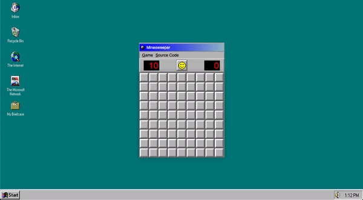
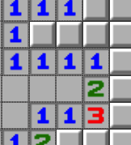
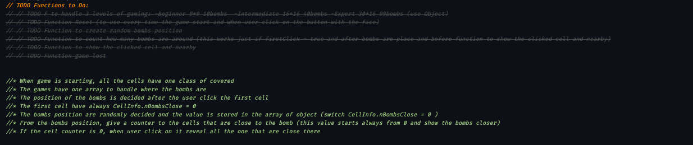

# Minesweeper 💣
<br>

by [Alberto Cerrone](www.linkedin.com/in/alberto-cerrone)<br>
Timeline: 7 days

👉 [<b>Try Me</b>](https://bit.ly/3qhLWmg) 👈

---

### Table of Contents

- [Overview](#overview)
- [How To Play](#how-to-play)
  - [Required](#required)
  - [Installation Steps](#installation-steps)
  - [How To Play](#how-to-play)
- [How I Made It](#how-i-made-it)
  - [Technologies Used](#technologies-used)
  - [Approach Taken](#approach-taken)
  - [Bugs, Blockers & Wins](#bugs,-blockers-&-wins)
    - [Bugs](#bugs)
    - [Wins](#wins)
  - [Future Features & Key Learning](#future-features-&-key-learning)
    - [Future Features](#future-features)
    - [Key Learning](#key-learning)
- [Contributors](#contributors)
  - [Contributing to this project](#contributing-to-this-project) 
- [License & Copyright](#license-&-copyright)
- [Author Info](#author-info)

---
## Overview
<br>

This project is the representation of Minesweeper from Windows 95. <br>
As simple as it sounds, this was my first project in General Assembly's Software Engineering Immersive course. It was an individual project assigned to us after three weeks of learning and built in less than a week.<br>
As much as I would love to improve the code, I'm deciding to keep it as it is for two reasons:

- To show what I'm capable to build after just three weeks into coding
- Remind the future myself, that maybe will look back on those lines with nostalgia.

Talking about nostalgia, I decided to build Minesweeper from Windows 95 because take me back memories of my first computer my dad bought me when I was 6.<br>
If you are going to play this game, I hope you will have a good jump into the past and have good fun.<br>
Enjoy!

[Back To The Top](#minesweeper-)

---

## Play the Game

### Required

This game is a desktop-only website and requires the use of a mouse/trackpad.<br>
Please, take advantage of full-screen mode for a better experience.

### Installation steps

No installation is needed, just follow this [<i>link</i>](https://bit.ly/3qhLWmg)

### How to Play

The goal of the game is simple: <br>
<b>You have to find all the mines in the field! </b><br>
To do so, you have two types of input:<br>

- <i>Left Click</i>: Open the hidden block<br>
- <i>Right Click</i>: Flag the hidden block to sign a probable mine<br>

When you open a block, the game will show you a number between 1 to 8.<br>
Those are the mines adjacent to that block; they will be helpful to you to discover more bombs and finish the game



From the menu Game, you can decide between 3 levels of difficulty:<br>

- <i>Beginner</i>: 9x9 arena with ten mines to find;
- <i>Intermediate</i>: 16x16 arena with forty mines to find;
- <i>Expert</i>: 30x16 arena with 99 mines to find.<br>


If you desire to reset the game, you can click on the smiley face.


You can understand better the games rules from this Youtube's video:
[<i>How to play Minesweeper by Eric Buffington</i>](https://www.youtube.com/watch?v=7B85WbEiYf4)

[Back To The Top](#minesweeper-)

---

## How I Made It

### Technologies Used

The technologies used for this project are:<br>

- HTML5
- CSS with the seamless use of CSS Grid and Flexbox
- Vanilla JavaScript
- Photoshop for little UI details

### Approach Taken

Before starting to code, I threw down what are the key functionalities of this game. To do so I had fun playing to the game on Google and generated a little TODO list at the opening of my app.js file to keep track of the deliverables. I helped myself with the VSCode's extension "Better Comments" to better categorize my annotations.

<br>

I structured all the JS around level Beginner, but with the ending purpose of the multi-level experience. This mindset allowed me to directly develop all the functions ready to be used for level Intermediate and level Expert without the need of refactoring the code. To achieve this, the rendering of the mined floor is handled by JavaScript. <br>
Just at the end, when the game was perfectly working in level Beginner, I've added a function <code>changeLevel()</code> that manipulates UI and logic of all the different levels thanks to the "Game" dropdown.
```javascript
function changeLevel(event) {        //this function change the UI and the logic of the game for every level
    if (event === null) {
      return
    } else if (event.target.innerHTML === 'Intermediate') {
      width = 16
      height = 16
      cellCount = width * height
      nBombs = 40
      nFlags = nBombs
      flagsMonitor.innerHTML = nFlags
      grid.style.gridTemplateColumns = 'repeat(16, 1fr)'
      grid.style.gridTemplateRows = 'repeat(16, 1fr)'
      grid.style.width = '300px'
      gameWrapper.style.width = '300px'
      reset()
    } else if (event.target.innerHTML === 'Expert') {
      width = 30
      height = 16
      cellCount = width * height
      nBombs = 99
      nFlags = nBombs
      flagsMonitor.innerHTML = nFlags
      grid.style.gridTemplateColumns = 'repeat(30, 1fr)'
      grid.style.gridTemplateRows = 'repeat(16, 1fr)'
      grid.style.width = '600px'
      gameWrapper.style.width = '600px'
      reset()
    } else {
      width = 9
      height = 9
      cellCount = width * height
      nBombs = 10
      nFlags = nBombs
      flagsMonitor.innerHTML = nFlags
      grid.style.gridTemplateColumns = 'repeat(9, 1fr)'
      grid.style.gridTemplateRows = 'repeat(9, 1fr)'
      grid.style.width = '300px'
      gameWrapper.style.width = '300px'
      reset()
    }

```


[Back To The Top](#minesweeper-)

### Bugs, Blockers & Wins

#### Bugs

One of the weak points of my project is the use of CSS classes to keep track of the bombs' position. That allows the player to cheat, just opening the browser's console and running this two lines:
```javascript
document.querySelectorAll('.bomb').forEach((node) => node.classList.add('flagged'))
document.querySelectorAll('.covered:not(.bomb)').forEach((node) => node.click())
``` 
(Thank you, [Andrew Webb](https://github.com/androbwebb), for let me realize this issue).<br>

Another thing that I'm not proud of is UI. The background is not responsive, and I didn't have the opportunity to style it better cause of the incoming deadline.

#### Wins
I love how I've managed to create reusable functions for a much cleaner code.<br>
An example is the function <code>whoIsCloseToMe()</code>:

```javascript
function whoIsCloseToMe(index) {

    const column = cellsStatusInfo[index].column    
    const row = cellsStatusInfo[index].row       
    let cellDistance
    const closeToMe = []

    // up-left corner
    if (row > 0 && column > 0) {
      cellDistance = -(width + 1)
      closeToMe.push(cellsStatusInfo[index + cellDistance].idCell)
    }
    // up-center
    if (row > 0) {
      cellDistance = -(width)
      closeToMe.push(cellsStatusInfo[index + cellDistance].idCell)
    }
    //up-right
    if (row > 0 && column < width - 1) {
      cellDistance = -(width - 1)
      closeToMe.push(cellsStatusInfo[index + cellDistance].idCell)
    }
    //left
    if (column > 0) {
      cellDistance = - 1
      closeToMe.push(cellsStatusInfo[index + cellDistance].idCell)
    }
    //right
    if (column < width - 1) {
      cellDistance = + 1
      closeToMe.push(cellsStatusInfo[index + cellDistance].idCell)
    }
    //down-left
    if (row < height - 1 && column > 0) {
      cellDistance = width - 1
      closeToMe.push(cellsStatusInfo[index + cellDistance].idCell)
    }
    //down-center
    if (row < height - 1) {
      cellDistance = width
      closeToMe.push(cellsStatusInfo[index + cellDistance].idCell)
    }
    //down-right
    if (row < height - 1 && column <code width - 1) {
      cellDistance = width + 1
      closeToMe.push(cellsStatusInfo[index + cellDistance].idCell)
    }
    return closeToMe
}
```
I've used this function to find the cells that are close to the selected one and this is being useful for two different cases:
  - Open the cells that are around 
  - Find how many bombs are around each cell.

[Back To The Top](#minesweeper-)

### Future Features & Key Learning

#### Future Features
I have no intention to modify this project for [this reason](#overview) but if I was going to work on it I would implement these features:

- Custom Game, to give to user the opportunity to choose the number of rows, columns and bombs
- Implement an audio button to toggle on/off the audio of the explosion 
- Opportunity to be used on touch screen devices
#### Key Learning

I loved this project because was my first made after learning basic concepts of HTML, CSS, and JavaScript. <br>
It taught me a lot about planning with the end goal in mind and to keep the code more understandable thanks to annotations. <br>

To improve even more the code and make it cleaner, I would refactor app.js in smaller components and replace those long functions with smaller functions that take care of just one thing.
This would help readability and future maintenance.


[Back To The Top](#minesweeper-)

---

## Contributors

- Alberto Cerrone [📧](mailto:cerrone.alberto93@gmail.com)


### Contributing to this project

If you have suggestions for improving this project, please [open an issue on GitHub](https://github.com/albertocerrone/Minesweeper/issues/new).<br>
I will fix just bugs but any suggestions you'll give me to improve the functionality of the game will be used as form of learning but not applied to the code.

[Back To The Top](#minesweeper-)

## License & Copyright

This work is dedicated to the [public domain (CC0 1.0)](http://creativecommons.org/publicdomain/zero/1.0/). To the extent possible under law, Alberto Cerrone has waived all copyright and related or neighboring rights to the Minesweeper Project. See the LICENSE file for all the legalese.

[Back To The Top](#minesweeper-)

## Author Info

- Twitter - [@AlbertoCerrone](https://twitter.com/AlbertoCerrone)
- LinkedIn - [Alberto Cerrone](http://www.linkedin.com/in/alberto-cerrone/)
- Website - [Portfolio](http://albertocerrone.co.uk)

[Back To The Top](#minesweeper-)
